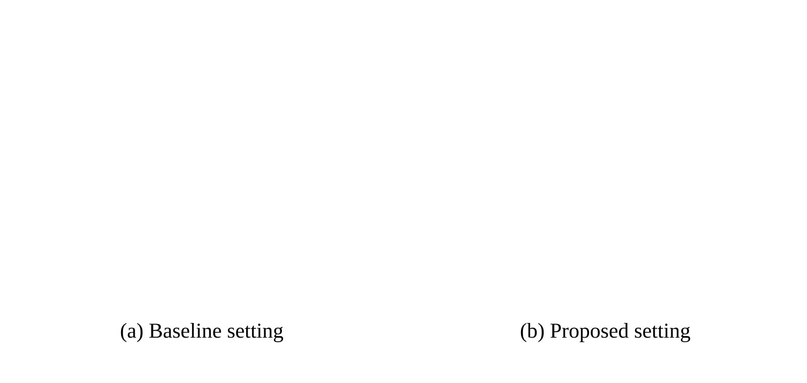
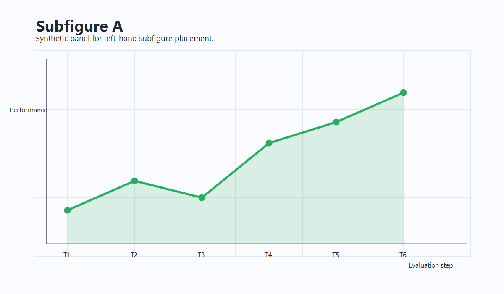
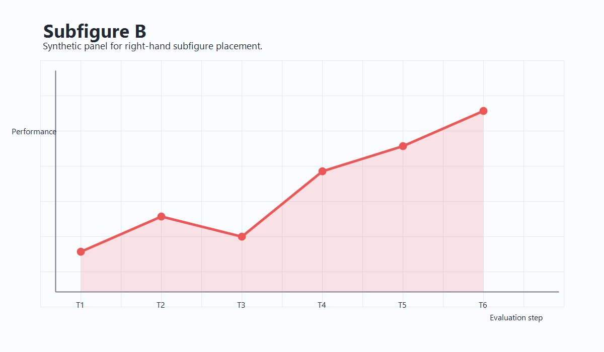

# 引言 {#sec:introduction}

本模板展示了使用 Pandoc Markdown 编写学术论文的基本结构和功能。请将这些示例内容替换为你自己的研究引言。

引言应形成连贯的叙述，将读者从一般研究背景引导到具体研究问题。首先介绍更广泛的研究领域及其重要性，然后通过引用已有工作说明研究背景，例如引用单篇文献 [@smith2023machine]、同时引用多篇文献 [@johnson2022data; @chen2024neural; @williams2023dataset]，或引用特定页码 [@garcia2022open, p. 237]。

已有研究取得了一些有意义的结果 [@williams2023dataset; @miller2023survey]，这构成了当前研究的动机。关于该领域的综述，可参见 @miller2023survey。尽管研究已经取得了显著进展，仍有若干问题尚未得到解决。

本研究关注三个核心问题：（1）主要研究问题是什么？（2）哪些次级问题能够支撑主要研究？（3）研究结果可以带来哪些实际意义？

本文的主要贡献包括三个方面。第一，提出[描述第一项贡献]。第二，给出[描述第二项贡献]。第三，证明[描述第三项贡献]。本文其余部分安排如下：@sec:methods 介绍研究方法，@sec:results 展示实验结果，[@sec:discussion] 讨论研究发现及局限性，@sec:conclusion 总结全文，@sec:subsection 中给出了实验设置的详细配置。

# 方法 {#sec:methods}

本节介绍研究所采用的方法。

## 实验设置 {#sec:subsection}

@tbl:setup 汇总了本研究使用的实验配置。

| **参数** | **取值** | **说明** |
| --- | --- | --- |
| 数据集规模 | 10,000 个样本 | 观测样本总数 |
| 训练集比例 | 70% | 用于模型训练的部分 |
| 验证集比例 | 15% | 用于超参数调整的部分 |
| 测试集比例 | $15\%$ | 用于最终评估的部分 |
| 交叉验证 | 5 折 | 交叉验证的折数 |

: 实验设置配置 {#tbl:setup}

上表演示了基本的表格格式。对于 DOCX 输出，也可以通过添加 Pandoc 表格属性或单元格合并标记使用高级格式功能（见 @tbl:advanced-formatting 和 @tbl:merged-cells）。

## 高级表格格式（仅 DOCX）

生成 DOCX 时，可以使用下列特殊功能增强表格格式。

### 表格属性

可以添加 Pandoc 属性来控制 DOCX 表格属性：

| **属性** | **取值** | **说明** |
| --- | --- | --- |
| 单元格边距 | 0.10 cm | 单元格内部留白 |
| 单元格间距 | 0 pt | 单元格之间的间距 |
| 自动调整 | 窗口 | 表格宽度调整方式 |
| 对齐方式 | 居中 | 表格在页面上的位置 |
| 修订标记 | 第 2 行 | 将修改文本标为红色 |

: 表格格式属性示例。{#tbl:advanced-formatting cell_margin="0.10cm" cell_spacing="0pt" autofit="window" alignment="center" revision_rows="*"}

上面的题注属性会应用到 DOCX 表格，但不会出现在最终题注中。

### 单元格合并

使用特殊标记合并单元格：`!<!` 向左合并，`!^!` 向上合并：

| **类别** | **子类别** | **数值** | **备注** |
| :---: | :---: | :---: | :---: |
| A 组 | 项目 1 | 10 | 第一项 |
| !^! | 项目 2 | 20 | 第二项 |
| B 组 | 项目 3 | 30 | 第三项 |
| !^! | 项目 4 | 40 | !<! |

: 使用标记合并单元格的示例。{#tbl:merged-cells}

在 @tbl:merged-cells 中，“A 组”和“B 组”分别跨越两行，最后一行的单元格跨越两列。

## 数学形式

所提出的方法可以用数学形式表示。考虑函数 $f(x)$：

$$
f(\boldsymbol{x}) = \sum_{i=1}^{n} w_i \boldsymbol{x_i + b}
$$ {#eq:linear}

其中，$w_i$ 表示权重参数，$x_i$ 表示输入特征，$b$ 表示偏置项。优化目标为最小化损失函数 $\mathcal{L}$：

$$
\mathcal{L}(\theta) = \frac{1}{N} \sum_{j=1}^{N} \ell(y_j, \hat{y}_j) + \lambda R(\theta)
$$ {#eq:loss}

其中，$\ell(\cdot)$ 是单样本损失，$R(\theta)$ 是正则化项，$\lambda$ 控制正则化强度。关于 @eq:loss 的实证验证，见 @sec:results。

## 研究流程

实验流程包括四个主要阶段。首先，根据[具体准则]清理并归一化输入数据，处理异常值和缺失值。其次，使用[方法名称]进行特征提取，从原始数据中提取[具体特征]。第三，使用[优化算法]和[具体超参数]优化 @eq:linear 与 @eq:loss，完成模型训练。最后，使用 @sec:results 中说明的指标和协议评估训练后的模型。

## 伪代码示例

当需要明确的逐步过程时，也可以用伪代码概括主要流程。在本模板中，伪代码采用单列表格表示，并可像普通表格一样引用，如算法 1 所示。

| **算法：数据准备与模型评估流程** |
| --- |
| **输入：** 原始数据集 $D$、模型族 $M$、评估指标 $s$ |
| **输出：** 训练后的模型 $\hat{m}$ 和评估得分 $\hat{s}$ |
| 1.\ \ 清理并归一化 $D$ 中的所有记录 |
| 2.\ \ 将 $D$ 划分为训练集、验证集和测试集 |
| 3.\ \ **for** 每一个候选模型 $m \in M$ **do** |
| 4.\ \ \ \ 在训练集上训练 $m$ |
| 5.\ \ \ \ 使用验证集调整超参数 |
| 6.\ \ **end for** |
| 7.\ \ 根据验证集表现选择最佳模型 $\hat{m}$ |
| 8.\ \ 在测试集上计算 $\hat{m}$ 的 $\hat{s}$ |
| 9.\ \ **return** $\hat{m}$ 和 $\hat{s}$ |
: {revision_rows="*"}

# 结果 {#sec:results}

本节介绍实验结果及其分析。

## 定量结果

@tbl:results 给出了不同方法的定量比较。

为了说明本模板中标准图像的插入和引用方式，下面在 @fig:single-example 中加入一个合成趋势图。该示例使用 `examples/images/` 下的图像，适合演示可复用模板中的相对路径。

<!-- 无题注图像测试 -->
{width=100%}

{#fig:single-example width=85%}

对于大多数多面板布局，建议准备一个通过相对路径引用子图像的 SVG 文件。@fig:subfigure-svg-example 中的 SVG 示例由 `examples/images/subfigure-a-example.png` 和 `examples/images/subfigure-b-example.png` 两个合成面板组成；在 Markdown 中，它仍然是一个带有单个题注和交叉引用标签的普通图形。

{#fig:subfigure-svg-example width=90%}

如果需要分别引用子图，请使用 YAML 头部中启用的内置子图网格支持。@fig:subfigure-example 给出了一个简单的双面板示例，说明子图可以共享一个主题注并分别使用标签。左侧面板（@fig:subfigure-a）可用于展示一个条件或消融案例，右侧面板（@fig:subfigure-b）可展示对应的比较设置。

{#fig:subfigure-a width=49%}
{#fig:subfigure-b width=49%}

使用两个合成面板的多子图布局示例。

| **方法** | **准确率（%）** | **精确率（%）** | **召回率（%）** | **F1 值（%）** |
| --- | --- | --- | --- | --- |
| 基线 | 78.3 | 76.5 | 79.2 | 77.8 |
| 方法 A | 85.7 | 84.2 | 86.5 | 85.3 |
| 方法 B | 89.1 | 88.3 | 89.8 | 89.0 |
| **本文方法** | **92.4** | **91.7** | **93.1** | **92.4** |

: 不同方法的性能比较。最佳结果以**粗体**标出。{#tbl:results}

如 @tbl:results 所示，本文方法在所有指标上都取得了更好的结果，相比基线准确率提高了 14.1 个百分点。

## 统计显著性

我们使用配对 $t$ 检验（$\alpha = 0.05$）进行统计显著性检验。与所有基线方法相比，@tbl:results 中的改进均具有统计显著性（$p < 0.001$）。

# 讨论 {#sec:discussion}

## 结果解释

@sec:results 中的结果说明了所提出方法的有效性。性能提升可以归因于三个主要因素。第一，@sec:methods 中介绍的改进特征表示使模型能够提取更具判别性的有效信息。第二，采用 @eq:loss 的优化训练流程在预测精度与泛化能力之间实现了更好的平衡。第三，@tbl:setup 中概述的稳健评估方法保证了性能估计在不同实验条件下具有可靠性和可复现性。

## 与相关工作的比较

已有工作 @anderson2021deep 在相似任务上取得了 87.2% 的准确率，低于本文方法的 92.4%（@tbl:results）。@chen2024neural 所采用的方法取得了相近的精确率，但召回率较低。

近期理论工作 [@lee2023chapter] 提供了一个有助于解释本文实证结果的框架。

## 局限性

本研究仍存在若干需要说明的局限性。结果基于特定数据集，将其推广到其他领域或应用场景仍需要进一步实证验证。此外，本文方法比简单基线方法需要更多计算资源，这可能限制其在资源受限环境中的应用。不同超参数配置也可能导致性能变化，因此在新的问题场景中需要谨慎调参。

## 未来工作

未来可以从几个方向开展研究。扩大数据集规模有助于验证方法的可扩展性和稳健性。结合[相关领域]的最新进展可能进一步提升性能。研究真实应用中的部署问题，包括计算效率和系统集成，有助于推动实际应用。最后，系统分析失败案例和边界条件可以更深入地认识方法局限并指导后续改进。

# 结论 {#sec:conclusion}

本文提出了[主要贡献的简要总结]。如 @tbl:results 所示，所提出方法取得了[关键结果]，相对于现有基线在[具体指标]上有所提升。@sec:methods 中介绍的方法为[应用领域]提供了系统框架，@sec:results 中的实验验证了其在多个评价指标上的有效性。

本 Pandoc Markdown 模板支持自动 DOCX 格式化、表格、章节和公式的交叉引用、基于 CSL 的灵活引文样式、数学符号以及可选的 LaTeX 源码生成。请根据目标期刊的要求修改 YAML 头部，以调整格式和引文样式。

# 数据和代码可用性 {.unnumbered}

[可根据目标期刊要求补充数据和代码可用性信息]

# 致谢 {.unnumbered}

本研究得到[资助来源]支持。感谢[个人或机构]提供的[具体贡献]。

# 作者贡献 {.unnumbered}

**第一作者**：概念设计、方法学、论文撰写——初稿
**第二作者**：调查、形式分析、论文撰写——审阅与编辑
**第三作者**：资源、指导、经费获取

# 利益冲突 {.unnumbered}

作者声明不存在利益冲突。
