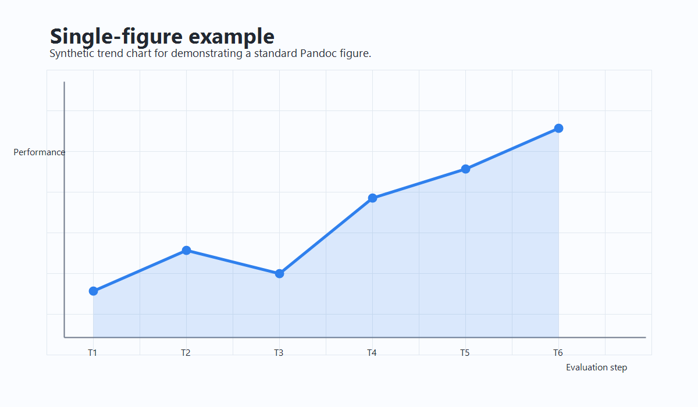
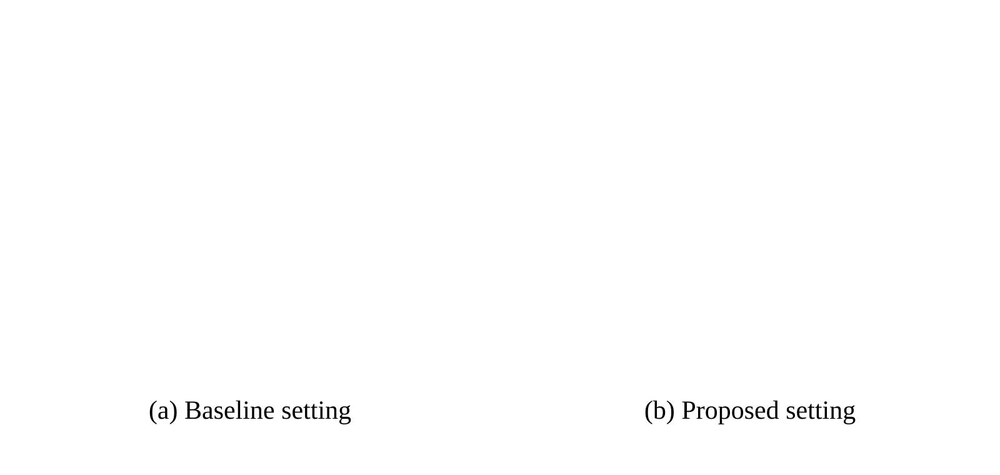

# Reply to comments of reviewers

::: {custom-style="Reply Header"}
**Title:** Your Manuscript Title: A Comprehensive Study

**Journal:** Example Journal

**Authors:** First Author, Second Author

**Manuscript Number:** EJ-2026-0001

 

The authors would like to thank the editors and reviewers for their interest in the paper, and the constructive comments and suggestions. The manuscript has been revised according to the reviewers’ comments. For easy reference, the reviewers’ suggestions are copied, followed by the answers.
:::

# Editor and Reviewer(s)' Comments to Author:

## Editor:

Please provide a clear overview of the principal revisions and ensure that every substantive response identifies where the corresponding change appears in the manuscript.

::: {custom-style="Reply to Reviewers"}
_Answer:_

We have organized the revision around four areas. We clarified the motivation and contributions in @sec:introduction (Line `The introduction should provide\s+a coherent narrative that guides readers`), expanded the methodological and reproducibility details in @sec:methods (Line `The experimental procedure consists of four main stages`), consolidated the quantitative and visual evidence in @sec:results (Line `This section presents the experimental results and analysis`), and added an explicit discussion of scope and limitations in @sec:discussion (Line `This study has several limitations that should be acknowledged`). The detailed changes and the corresponding manuscript excerpts are provided in the responses below.
:::

 

## Reviewer 1:

The manuscript is generally well organized, but the motivation, experimental protocol, mathematical formulation, and quantitative evidence should be presented more explicitly.

::: {custom-style="Reply to Reviewers"}
_Answer:_

We have revised the introduction, methods, and results sections to make the research questions, evaluation protocol, mathematical definitions, and supporting evidence easier to follow. The individual changes are described in the point-by-point responses below.
:::

 

1\. The introduction does not sufficiently connect the broader research context to the specific questions and contributions of the study. Please strengthen the motivation and cite the relevant literature more clearly.

::: {custom-style="Reply to Reviewers"}
_Answer:_

We revised @sec:introduction to connect the broader context to the research questions and to distinguish the three contributions more explicitly (Line `The introduction should provide\s+a coherent narrative that guides readers`). The revision also demonstrates individual citations, grouped citations, page-specific citations, and section cross-references without interrupting the narrative.

The revised text is as follows:

_The introduction should provide a coherent narrative that guides readers from the general context to your specific research. Start by establishing the broader research area and its importance. You can cite previous work to provide context [@smith2023machine], cite multiple works together [@johnson2022data; @chen2024neural; @williams2023dataset], or refer to specific pages [@garcia2022open, p. 237]._

_The main contributions of this work are threefold. First, we propose [describe first contribution]. Second, we provide [describe second contribution]. Third, we demonstrate [describe third contribution]. The remainder of this paper is organized as follows: @sec:methods describes the methodology, @sec:results presents experimental results, [@sec:discussion] discusses the findings and limitations, and @sec:conclusion concludes the paper._
:::

 

2\. The manuscript should report the dataset split, validation strategy, and evaluation configuration in a reproducible form.

::: {custom-style="Reply to Reviewers"}
_Answer:_

We consolidated the experimental configuration in @tbl:setup so that the dataset size, training/validation/test split, and cross-validation protocol can be checked in one place (Line `Table\s+\d+\s+Experimental setup configuration`). The table is reproduced below.

| **Parameter**    | **Value**      | **Description**                        |
| ---------------- | -------------- | -------------------------------------- |
| Dataset size     | 10,000 samples | Total number of observations           |
| Training split   | 70%            | Portion used for model training        |
| Validation split | 15%            | Portion used for hyperparameter tuning |
| Test split       | $15\%$         | Portion used for final evaluation      |
| Cross-validation | 5-fold         | Number of folds for CV                 |

: Experimental setup configuration {#tbl:setup}
:::

 

3\. The optimization objective is not sufficiently explicit. Please provide the complete loss function and define every term.

::: {custom-style="Reply to Reviewers"}
_Answer:_

We expanded the mathematical formulation in @sec:methods and now state the optimization objective as @eq:loss, followed immediately by definitions of the loss, regularization term, and regularization weight (Line `The optimization objective minimizes the loss function`).

The revised formulation is as follows:

_The optimization objective minimizes the loss function $\mathcal{L}$:_

$$
\mathcal{L}(\theta) = \frac{1}{N} \sum_{j=1}^{N} \ell(y_j, \hat{y}_j) + \lambda R(\theta)
$$ {#eq:loss}

_“where $\ell(\cdot)$ is the per-sample loss, $R(\theta)$ is a regularization term, and $\lambda$ controls the regularization strength. See @sec:results for empirical validation of @eq:loss.”_
:::

 

4\. The performance claims should be supported by a complete quantitative comparison rather than a narrative summary alone.

::: {custom-style="Reply to Reviewers"}
_Answer:_

We added a complete comparison in @tbl:results and summarized the improvement over the baseline directly after the table (Line `Table\s+\d+\s+Performance comparison across different methods`). The table reports accuracy, precision, recall, and F1-score for all methods, with the best values highlighted in bold.

| **Method**   | **Accuracy (%)** | **Precision (%)** | **Recall (%)** | **F1-Score (%)** |
| ------------ | ---------------- | ----------------- | -------------- | ---------------- |
| Baseline     | 78.3             | 76.5              | 79.2           | 77.8             |
| Method A     | 85.7             | 84.2              | 86.5           | 85.3             |
| Method B     | 89.1             | 88.3              | 89.8           | 89.0             |
| **Proposed** | **92.4**         | **91.7**          | **93.1**       | **92.4**         |

: Performance comparison across different methods. Best results in **bold**. {#tbl:results}

_As shown in @tbl:results, the proposed method achieves superior performance across all metrics, with accuracy improvements of 14.1 percentage points over the baseline._
:::

 

5\. Please add visual evidence and demonstrate how both a conventional figure and a multi-panel figure are presented in the revised manuscript.

::: {custom-style="Reply to Reviewers"}
_Answer:_

We added a conventional raster figure in @fig:single-example (Line `Figure\s+\d+\s+A single-figure example showing a synthetic performance trend`) and an SVG-based multi-panel figure in @fig:subfigure-svg-example (Line `Figure\s+\d+\s+An SVG-based multi-panel layout`). The first demonstrates a standard relative image path, while the second keeps the child-panel layout in a reusable SVG asset.

{#fig:single-example width=85%}

{#fig:subfigure-svg-example width=90%}
:::

 

## Reviewer 2:

The manuscript would benefit from clearer examples of document-specific formatting, a more explicit workflow description, stronger comparison with related work, and a candid discussion of the current limitations.

::: {custom-style="Reply to Reviewers"}
_Answer:_

We expanded the examples of DOCX table formatting, added a step-by-step workflow, strengthened the related-work comparison, and revised the limitations and future-work discussion. These changes are detailed below.
:::

 

1\. Please clarify whether the revised tables support document-specific formatting such as cell margins, revision marking, and merged cells.

::: {custom-style="Reply to Reviewers"}
_Answer:_

We added two complementary examples in @sec:methods. @tbl:advanced-formatting demonstrates DOCX table attributes such as cell margins, spacing, autofit, alignment, and revision-row marking (Line `Table\s+\d+\s+Table formatting properties`). @tbl:merged-cells demonstrates vertical and horizontal cell merging with explicit markers (Line `Table\s+\d+\s+Example of merged cells using markers`).

| **Property** | **Value** | **Description**        |
| ------------ | --------- | ---------------------- |
| Cell margins | 0.10 cm   | Padding inside cells   |
| Cell spacing | 0 pt      | Space between cells    |
| Autofit      | Window    | Table width adjustment |
| Alignment    | Center    | Table position on page |
| Revisions    | Row 2     | Mark changed text red  |

: Table formatting properties. {#tbl:advanced-formatting cell_margin="0.10cm" cell_spacing="0pt" autofit="window" alignment="center" revision_rows="*"}

| **Category** | **Subcategory** | **Value** |  **Notes**  |
| :----------: | :-------------: | :-------: | :---------: |
|   Group A    |     Item 1      |    10     | First item  |
|     !^!      |     Item 2      |    20     | Second item |
|   Group B    |     Item 3      |    30     | Third item  |
|     !^!      |     Item 4      |    40     |     !<!     |

: Example of merged cells using markers. {#tbl:merged-cells}
:::

 

2\. The experimental workflow is described in prose, but a concise step-by-step representation would improve reproducibility.

::: {custom-style="Reply to Reviewers"}
_Answer:_

We added a captionless one-column pseudocode table in @sec:methods to summarize data preparation, model selection, tuning, and final evaluation (Line `The main workflow can also be summarized as pseudocode`). This format is useful when the workflow itself is more important than a separate visible table caption.

_The main workflow can also be summarized as pseudocode when an explicit step-by-step procedure is useful. In this template, pseudocode is represented as a one-column table and can be cited as a normal table, as shown in Algorithm 1._

| **Algorithm: Dataset preparation and model evaluation workflow** |
|---|
| **Input:** Raw dataset $D$, model family $M$, evaluation metric $s$ |
| **Output:** Trained model $\hat{m}$ and evaluation score $\hat{s}$ |
| 1.\ \ Clean and normalize all records in $D$ |
| 2.\ \ Split $D$ into training, validation, and test subsets |
| 3.\ \ **for** each candidate model $m \in M$ **do** |
| 4.\ \ \ \ Train $m$ on the training subset |
| 5.\ \ \ \ Tune hyperparameters using the validation subset |
| 6.\ \ **end for** |
| 7.\ \ Select the best model $\hat{m}$ according to validation performance |
| 8.\ \ Compute $\hat{s}$ for $\hat{m}$ on the test subset |
| 9.\ \ **return** $\hat{m}$ and $\hat{s}$ |
: {revision_rows="*"}
:::

 

3\. The discussion should compare the reported performance with relevant prior studies and explain how the literature supports the interpretation.

::: {custom-style="Reply to Reviewers"}
_Answer:_

We strengthened the comparison with related work in @sec:discussion by connecting the numerical results in @tbl:results to both an empirical baseline and a theoretical reference (Line `achieved\s+87\.2% accuracy on similar tasks`).

The revised text is as follows:

_Previous work by @anderson2021deep achieved 87.2% accuracy on similar tasks, which is lower than our proposed method's 92.4% (@tbl:results). The approach by @chen2024neural reported comparable precision but lower recall._

_Recent theoretical work [@lee2023chapter] provides a framework that helps explain our empirical results._
:::

 

4\. The conclusions appear broader than the evidence currently supports. Please discuss generalization, computational requirements, and the remaining validation needs.

::: {custom-style="Reply to Reviewers"}
_Answer:_

We cannot fully establish cross-domain generalization from the current experiment alone. We therefore narrowed the claim and added an explicit limitations paragraph in @sec:discussion (Line `This study has several limitations that should be acknowledged`), followed by concrete future-validation directions (Line `Several promising directions exist for future research`).

The added limitation is as follows:

_This study has several limitations that should be acknowledged. The results are based on a specific dataset, and generalization to other domains or application contexts requires further empirical validation. Additionally, the proposed method requires more computational resources than simpler baseline approaches, which may limit its applicability in resource-constrained environments. Performance may also vary with different hyperparameter configurations, requiring careful tuning for optimal results in new problem settings._

The corresponding future-work statement is as follows:

_Several promising directions exist for future research. Extension to larger-scale datasets would help validate the scalability and robustness of the proposed approach. Integration with recent advances in [related field] could potentially enhance performance further. Investigating deployment considerations for real-world applications, including computational efficiency and system integration challenges, would facilitate practical adoption. Finally, systematic investigation of failure cases and edge conditions would provide deeper insights into the method's limitations and guide future improvements._
:::

 

5\. Please confirm that the manuscript contains the required conflict-of-interest disclosure.

::: {custom-style="Reply to Reviewers"}
_Answer:_

The disclosure is included in the unnumbered Conflict of Interest section (Line `The authors declare no conflict of interest`). The statement reads: _The authors declare no conflict of interest._
:::
